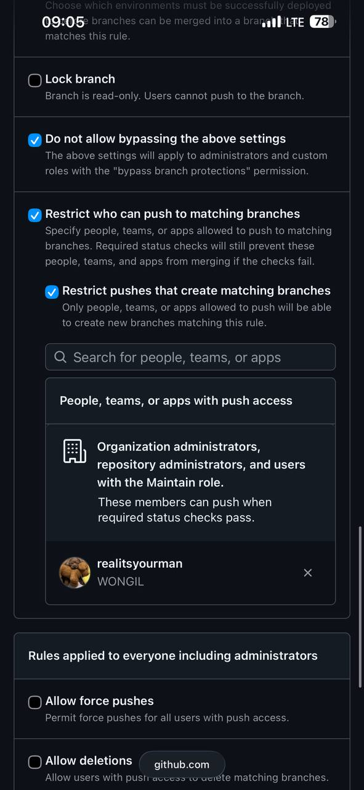
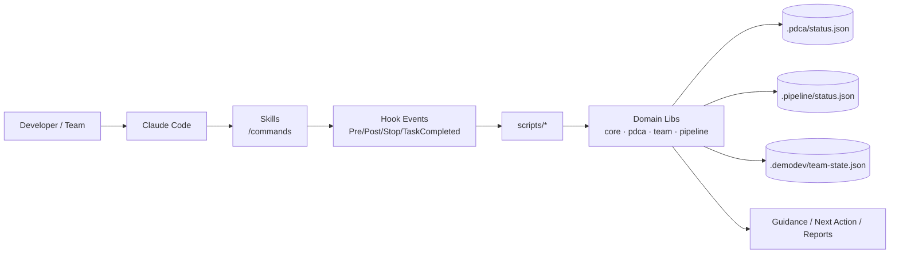
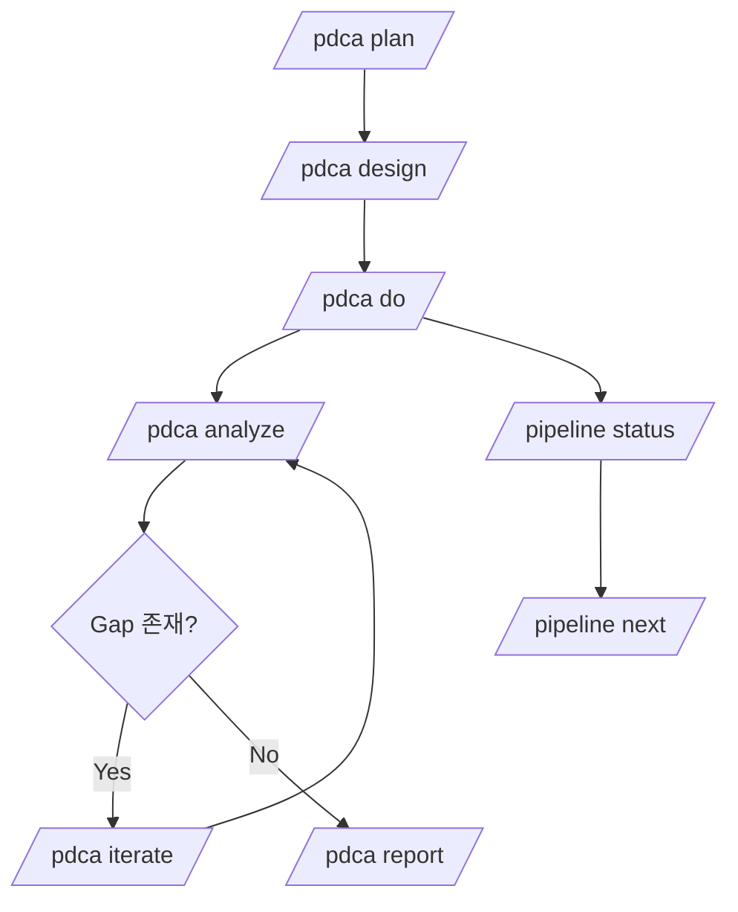

<p align="center">
  
</p>

# demokit

> Spring Boot 백엔드 개발을 위한 **Claude Code 플러그인**
> 
> PDCA 워크플로우 + 멀티 에이전트 오케스트레이션 + 안전한 훅 검증을 한 번에 제공합니다.

---

## 왜 demokit인가?

`demokit`은 단순 코드 생성기가 아니라, **설계 → 구현 → 리뷰 → 개선** 루프를 자동화하는 Spring Boot 특화 개발 워크플로우입니다.

### 핵심 포인트
- ✅ **34개 슬래시 커맨드** (`/crud`, `/pdca`, `/pipeline`, `/review`, `/superwork` 등)
- ✅ **PDCA 6단계** 기반 기능 개발
- ✅ **멀티 에이전트 팀 실행** (level override + delegate mode 지원)
- ✅ **Pipeline phase 스크립트 분리** (pre/post/stop/transition)
- ✅ **Hook/Plugin validator** 내장 (`validate:plugin`, `validate:hooks`)
- ✅ **문서 드리프트 방지** (`check:graph-index`)

### 아키텍처 한눈에 보기



### 실행 흐름 (PDCA + Pipeline)



---

## 요구사항

- [Claude Code](https://docs.anthropic.com/en/docs/claude-code) >= 1.0.0
- Node.js

---

## 설치

## 1) 마켓플레이스 설치 (권장)

Claude Code 대화창에서:

```text
/plugin marketplace add demodev-lab/claude-code-plugin-demokit
/plugin install demokit@demodev-plugins
```

> 비공개 레포를 쓸 경우 `gh auth login`이 먼저 필요할 수 있습니다.

### 팀 자동 배포 예시 (`.claude/settings.json`)

```json
{
  "extraKnownMarketplaces": {
    "demodev-plugins": {
      "source": {
        "source": "github",
        "repo": "demodev-lab/claude-code-plugin-demokit"
      }
    }
  },
  "enabledPlugins": {
    "demokit@demodev-plugins": true
  }
}
```

## 2) 로컬 설치

```bash
git clone https://github.com/demodev-lab/claude-code-plugin-demokit.git
cd /path/to/your-spring-project
claude --plugin-dir /path/to/claude-code-plugin-demokit
```

> 반드시 **플러그인 폴더가 아니라 작업 대상 프로젝트 폴더**에서 실행하세요.

---

## 3분 온보딩 (처음 쓰는 사람용)

### Step 1) 프로젝트 초기화

```text
/init
```

### Step 2) 도메인 생성

```text
/crud User
```

### Step 3) 리뷰

```text
/review
```

### Step 4) PDCA 개발 루프 시작

```text
/pdca plan 회원관리
/pdca design 회원관리
/pdca do 회원관리
/pdca analyze 회원관리
```

### Step 5) 파이프라인 상태 확인

```text
/pipeline user-management
/pipeline status
/pipeline next
```

---

## 주요 커맨드

| 카테고리 | 커맨드 |
|---|---|
| 프로젝트 | `/init`, `/help` |
| CRUD/코드 생성 | `/crud`, `/entity`, `/repository`, `/service`, `/controller`, `/dto` |
| 품질/분석 | `/review`, `/test`, `/qa`, `/optimize`, `/erd` |
| 워크플로우 | `/pdca`, `/pipeline`, `/loop`, `/plan-plus`, `/cancel-loop` |
| 슈퍼워크 오케스트레이션 | `/superwork` |
| 인프라/설정 | `/config`, `/security`, `/docker`, `/gradle`, `/migration`, `/api-docs` |
| Git | `/commit`, `/commit-push`, `/push`, `/pr`, `/changelog` |

> 개별 사용법은 `/{command} help`로 확인.

### `superwork` 빠른 사용법

- 입력 형식: `/superwork "<구현내용>"`
- 예시: `/superwork 회원가입 API 구현`
- 동작:
  - 요청을 Plan/Design/Do/Analyze/Iterate/Report 단계로 분해
  - 팀 설정을 반영해 병렬 작업 후보를 제안
  - `/pdca` 흐름(`plan/design/do/analyze/...`)과 `do` 체크리스트를 한 번에 제시


### bkit 호환 alias 커맨드

- `/code-review` -> `/review`
- `/zero-script-qa` -> `/qa`
- `/development-pipeline` -> `/pipeline`
- `/starter`, `/dynamic`, `/enterprise` (프로파일 가이드)
- `/phase-1-schema` ... `/phase-9-deployment` (phase 가이드)

자세한 매핑: [`docs/compatibility-command-map.md`](./docs/compatibility-command-map.md)

---

## 멀티 에이전트/레벨 모델

`demokit`은 토폴로지 레벨과 호환 프로파일을 같이 지원합니다.

- Topology: `SingleModule`, `MultiModule`, `Monolith`, `MSA`
- Compatibility profile: `Dynamic`, `Enterprise`

기본 매핑:
- `SingleModule` → `Dynamic`
- `MultiModule` → `Dynamic`
- `Monolith` → `Dynamic`
- `MSA` → `Enterprise`

`team.levelProfileMap`으로 커스텀 가능.

---

## 추천 설정 프리셋

### A) Production 기본 (품질/속도 균형)

```json
{
  "team": {
    "delegateMode": false,
    "maxTeammates": { "SingleModule": 3, "MSA": 5 }
  },
  "developmentPipeline": {
    "phaseScripts": {
      "enabled": true,
      "preEnabled": false,
      "postEnabled": false,
      "transitionEnabled": true
    }
  }
}
```

### B) Demo/긴급 대응 (속도 우선)

```json
{
  "team": {
    "levelOverrides": {
      "SingleModule": {
        "delegateMode": true,
        "maxTeammates": 1
      }
    },
    "performance": {
      "emitTransitionHints": false
    }
  }
}
```

---

## 검증 명령어 (릴리즈/배포 전 필수)

```bash
npm run validate:plugin -- --verbose
npm run validate:hooks
npm run check:graph-index
npm test -- --runInBand
```

---

## 설정 우선순위

`demodev.config.json`은 다음 우선순위로 적용됩니다:

1. project (`./demodev.config.json`)
2. session
3. user
4. plugin (`demokit/demodev.config.json`)

---

## 프로젝트 구조 (요약)

```text
demokit/
├── .claude-plugin/          # plugin/marketplace metadata
├── agents/                  # 전문 에이전트 프롬프트
├── skills/                  # 34개 슬래시 커맨드
├── hooks/                   # Claude Code hook registry
├── scripts/                 # hook/pipeline/runtime scripts
├── lib/                     # core, pdca, team, pipeline, task
├── templates/               # 코드/공유 템플릿
├── output-styles/           # 보고 스타일
├── demokit-system/          # 시스템 문서(구조/시나리오)
├── docs/                    # 운영/아키텍처 레퍼런스
└── demodev.config.json      # 정책/성능/팀 설정
```

---

## 문서 바로가기

- 운영 가이드: [`CUSTOMIZATION-GUIDE.md`](./CUSTOMIZATION-GUIDE.md)
- 변경 이력: [`CHANGELOG.md`](./CHANGELOG.md)
- 명령 허브: [`commands/demokit.md`](./commands/demokit.md)
- 출력 스타일 설치: [`commands/output-style-setup.md`](./commands/output-style-setup.md)
- 시스템 문서: [`demokit-system/README.md`](./demokit-system/README.md)
- 레퍼런스 문서 허브: [`docs/README.md`](./docs/README.md)

---

## 라이선스

MIT — [`LICENSE`](./LICENSE)
