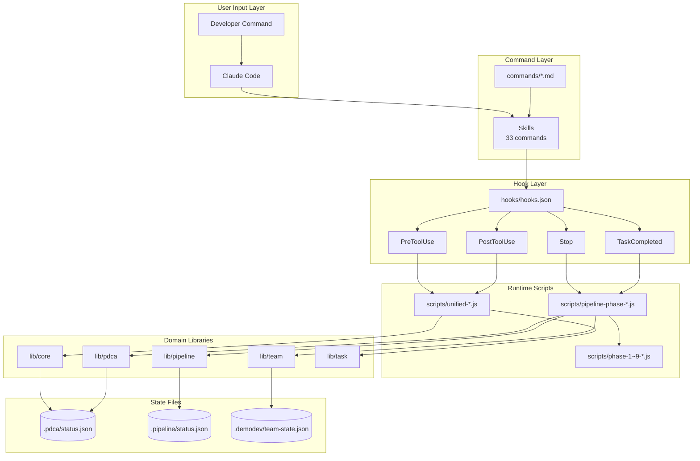
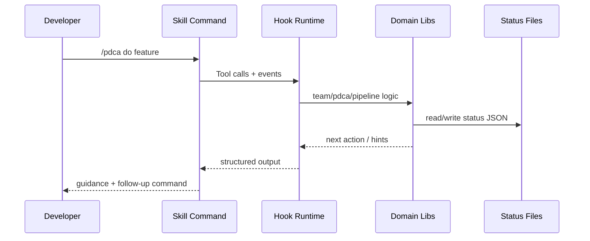

# Architecture Overview

demokit의 런타임 구조를 빠르게 이해하기 위한 문서.

## Core Layers

1. **Skills** (`skills/*`)
   - 사용자 명령 인터페이스
2. **Hooks** (`hooks/hooks.json`, `scripts/*`)
   - Tool/Stop/TaskCompleted 이벤트 후처리
3. **Domain Libs** (`lib/*`)
   - pdca/team/pipeline/memory/core
4. **Config** (`demodev.config.json`)
   - 오케스트레이션/성능/권한 정책

## System Map (Mermaid)

## Runtime Sequence (Mermaid)

## Important Data Files

- `.pdca/status.json` : PDCA 상태
- `.pipeline/status.json` : 파이프라인 상태
- `.demodev/team-state.json` : 팀 상태

## Runtime Characteristics

- hook 스크립트는 프로세스 단위로 독립 실행
- 상태 공유는 파일(JSON) 기반
- 성능 최적화는 캐시 + fan-out 제어 + timeout 관리가 핵심
