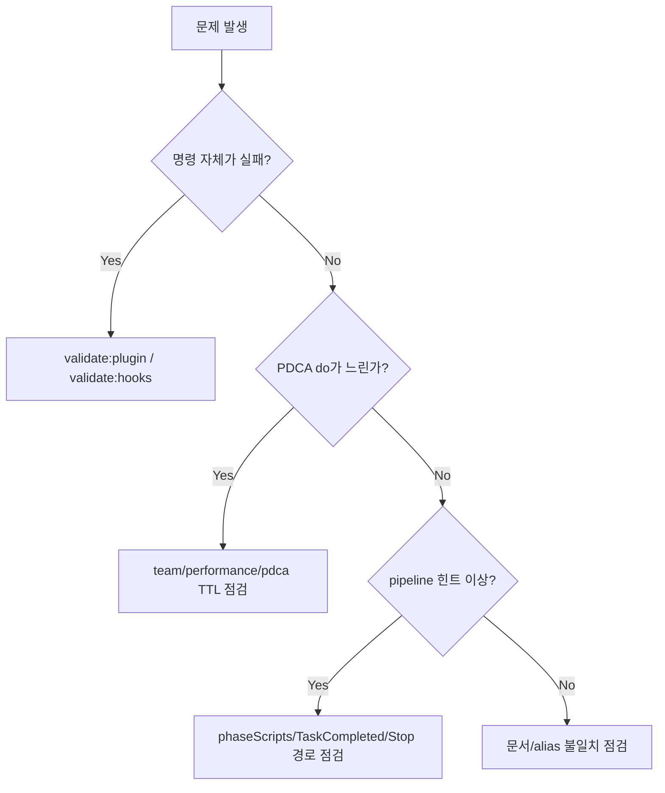

# Incident Response Playbook

운영 중 지연/오동작 발생 시 단계별 대응 가이드.

---

## Severity 분류

- **SEV-1**: 개발 흐름 전면 중단 (명령 실행 불가, 상태 파일 손상)
- **SEV-2**: 핵심 흐름 지연 (PDCA do 과지연, hook timeout 다수)
- **SEV-3**: 부분 기능 이상 (특정 alias/문서 불일치)

---

## 1차 대응 (공통)

```bash
npm run validate:plugin -- --verbose
npm run validate:hooks
npm run check:graph-index
npm test -- --runInBand
```

---

## 증상별 분기



---

## PDCA 지연 시 빠른 조치

1. `team.levelOverrides.SingleModule.delegateMode=true`로 임시 축소
2. `team.performance.phaseMemberCap.do.SingleModule=1`
3. `developmentPipeline.phaseScripts.preEnabled/postEnabled=false`
4. 재검증 후 정상화되면 점진 복구

---

## 파이프라인 힌트 안 나올 때

체크:
- `.pipeline/status.json` 존재 여부
- `developmentPipeline.phaseScripts.transitionEnabled`
- `hooks.runtime.events.TaskCompleted`
- `hooks.runtime.scripts.pipelinePhaseTransition`

---

## 복구 후 회고 템플릿

- 발생 시간:
- 증상:
- 원인:
- 임시 조치:
- 영구 조치:
- 재발 방지 액션:
