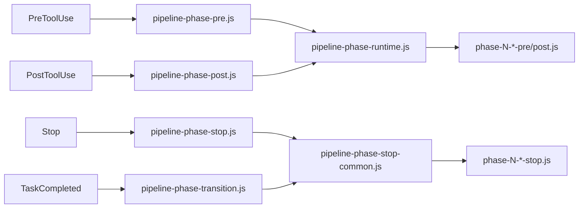
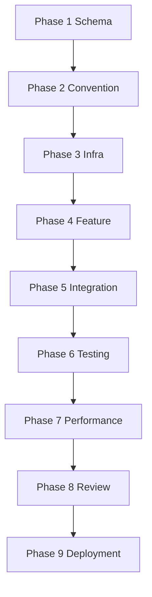

# Pipeline Phase Scripts Guide

## Scripts

### Dispatcher

- `scripts/pipeline-phase-pre.js`
- `scripts/pipeline-phase-post.js`
- `scripts/pipeline-phase-stop.js`
- `scripts/pipeline-phase-transition.js`

### Phase-specific

- `scripts/phase-1-schema-{pre,post,stop}.js`
- ...
- `scripts/phase-9-deployment-{pre,post,stop}.js`

## Hook Integration

- PreToolUse: `pipeline-phase-pre.js`
- PostToolUse: `pipeline-phase-post.js`
- Stop: `pipeline-phase-stop.js`
- TaskCompleted: `pipeline-phase-transition.js`

## Runtime Toggle

`developmentPipeline.phaseScripts`:

- `enabled`
- `preEnabled`
- `postEnabled`
- `transitionEnabled`

기본 권장:
- pre/post: `false`
- transition: `true`

## Phase Runtime Architecture

## Pipeline Stage Timeline

