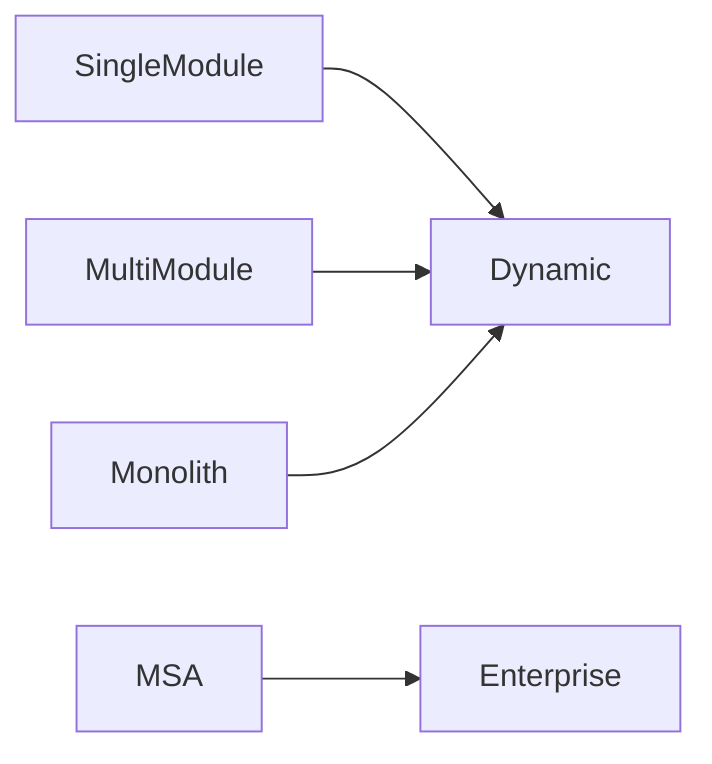
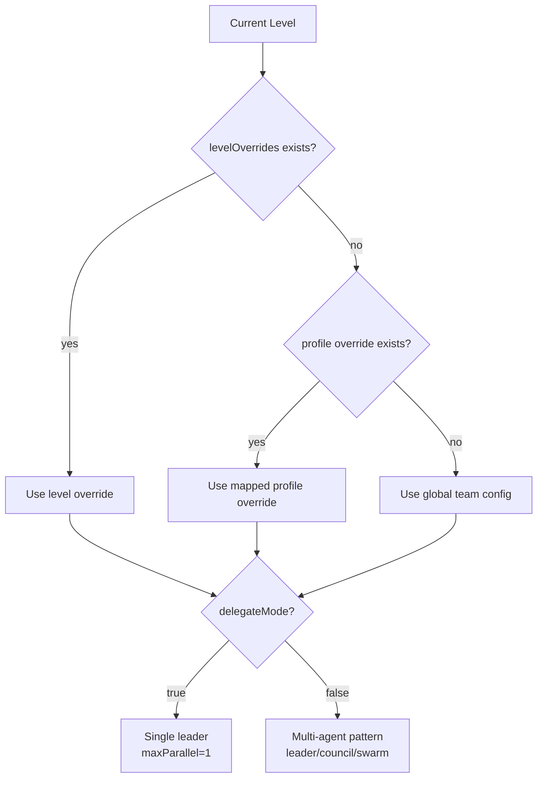

# Team Orchestration Guide

## Level Model

- demokit topology levels: `SingleModule`, `MultiModule`, `Monolith`, `MSA`
- bkit profile compatibility: `Dynamic`, `Enterprise`

## Compatibility Mapping

기본 매핑:

- `SingleModule` -> `Dynamic`
- `MultiModule` -> `Dynamic`
- `Monolith` -> `Dynamic`
- `MSA` -> `Enterprise`

`demodev.config.json > team.levelProfileMap`으로 커스텀 가능.

## Level Mapping Diagram



## Config Priority (Team)

```mermaid
flowchart TD
    A[levelOverrides(Level)] --> B[levelOverrides(Profile)]
    B --> C[team.performance]
    C --> D[team.phaseTeams]
    D --> E[team.maxTeammates]
    E --> F[DEFAULT_PHASE_TEAMS]
```

## Level Overrides

`team.levelOverrides.<Level>`로 레벨별 오케스트레이션 정책 적용:

- `delegateMode`
- `maxTeammates`
- `phaseTeams`
- `performance`

## Delegate Mode

`delegateMode=true`면 phase를 단일 리더 중심으로 축소:

- `pattern: leader`
- `members: [delegateAgent]`
- `maxParallel: 1`

데모/긴급 대응에서는 유리, 품질 심화 리뷰는 멀티 모드 권장.

## Delegate Decision Flow


